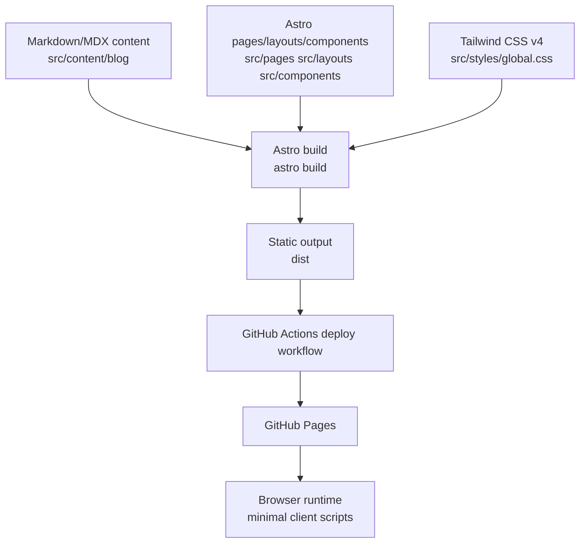

# Architecture

## System overview

`bachboy0.github.io` is a static personal website and blog built with Astro 5 and Tailwind CSS 4.

- **Problem solved:** publish multilingual personal pages and blog posts with low operational overhead.
- **System boundary:** repository source files, Astro build pipeline, and static hosting on GitHub Pages.
- **Out of scope (non-goals):** user accounts, server-side APIs, mutable database storage, and real-time backend processing.

## High-level architecture



## Components and responsibilities

| Area | Path | Responsibility |
| --- | --- | --- |
| Head/meta | `src/components/BaseHead.astro` | SEO tags, canonical, OG/Twitter metadata, CSP meta, referrer policy, font preloads |
| Layout shell | `src/layouts/BaseLayout.astro` | Shared document/frame for standard pages |
| Blog layout | `src/layouts/BlogPost.astro` | Blog article framing, dates, hero image rendering |
| Navigation/footer | `src/components/Header.astro`, `Footer.astro`, `LanguagePicker.astro` | Site navigation, locale switch, footer links |
| Blog content | `src/content/blog/*.{md,mdx}` | Localized post sources |
| Content schema | `src/content.config.ts` | Frontmatter validation (`title`, `description`, dates, optional image, `lang`) |
| Routing | `src/pages/**` | File-based route definitions for `en`, `ja`, `ko`, plus RSS endpoint |
| i18n helpers | `src/i18n/ui.ts`, `src/i18n/utils.ts` | UI strings and path/locale utility functions |

## Data model overview

There is no database. The primary data entities are build-time content objects.

| Entity | Source | Key fields |
| --- | --- | --- |
| Blog post | `src/content/blog/*.{md,mdx}` | `title`, `description`, `pubDate`, `updatedDate?`, `heroImage?`, `lang` |
| Translation dictionary | `src/i18n/ui.ts` | keyed UI strings by locale (`en`, `ja`, `ko`) |

## API/module overview

There are no authenticated backend APIs.

| Endpoint/module | File | Notes |
| --- | --- | --- |
| RSS feed endpoint | `src/pages/rss.xml.js` | Build/runtime endpoint returning RSS XML |
| Dynamic blog routes | `src/pages/blog/[...slug].astro`, `src/pages/ja/blog/[...slug].astro`, `src/pages/ko/blog/[...slug].astro` | `getStaticPaths()` resolves localized post routes |

Auth method: **Not applicable** (no auth layer).

## Runtime and deployment architecture

### Environments

- **Local development:** `npm run dev` (Astro dev server on port `4321`, host enabled in `astro.config.mjs`).
- **Production build:** `npm run build` outputs static files to `dist/`.
- **Production hosting:** GitHub Pages via `.github/workflows/deploy.yml` on pushes to `main`.

### Configuration and secrets

| Variable | Where observed | Purpose |
| --- | --- | --- |
| `HOST=0.0.0.0` | `Dockerfile` | Container host binding |
| `PORT=4321` | `Dockerfile` | Default Astro dev port |
| `NODE_ENV=development` | `compose.yaml` | Dev-mode container environment |
| `SSH_AUTH_SOCK=/ssh-agent` | `compose.yaml` | SSH agent forwarding path in container |

ASSUMPTION: no additional runtime application secrets are required for normal site operation.

### Delivery flow

1. Push to `main` triggers `.github/workflows/deploy.yml`.
2. `withastro/action` installs dependencies, builds, and uploads artifacts.
3. `actions/deploy-pages` publishes to GitHub Pages.

## Observability

Current observability is minimal.

- **Logging:** limited to local terminal output and GitHub Actions logs.
- **Metrics:** not implemented.
- **Tracing:** not implemented.
- **Error monitoring:** not implemented.

## Local development workflow

### Prerequisites

- Node.js LTS and npm, or
- Docker + Dev Containers/Compose

### Typical commands

```bash
npm install
npm run dev
npm run build
npm run preview
```

### Container workflow

- Dev container uses `.devcontainer/devcontainer.json` and `compose.yaml` service `astro`.
- Container forwards port `4321`.
- ASSUMPTION: development server is started manually with `npm run dev` inside the container workspace.

## Constraints and scaling notes

- Static-site model scales well for read-heavy traffic but requires rebuild/redeploy for content changes.
- No server runtime means low operational complexity but no dynamic per-request personalization.
- Localized routes are file-based; adding locales increases page count and build size linearly.
- `getStaticPaths()` slug handling for locale variants is currently asymmetric (`en` uses raw `post.id`; `ja/ko` strip suffix patterns).

Potential failure modes:

- Build failures from invalid content frontmatter schema.
- Broken links/route drift from inconsistent locale filename conventions.
- CSP strictness differences between dev and production affecting local debugging expectations.

## Security overview

Security controls are defined primarily in `src/components/BaseHead.astro` and policy/process details are documented in `SECURITY.md`.

Current controls include:

- Meta-delivered Content Security Policy (dev/production profiles)
- Referrer policy (`strict-origin-when-cross-origin`)
- Self-hosted fonts and minimal client JavaScript

Limitations:

- GitHub Pages does not provide custom response header configuration in this repo, so protections rely on document-level controls.

See `SECURITY.md` for threat model, reporting process, and hardening guidance.
